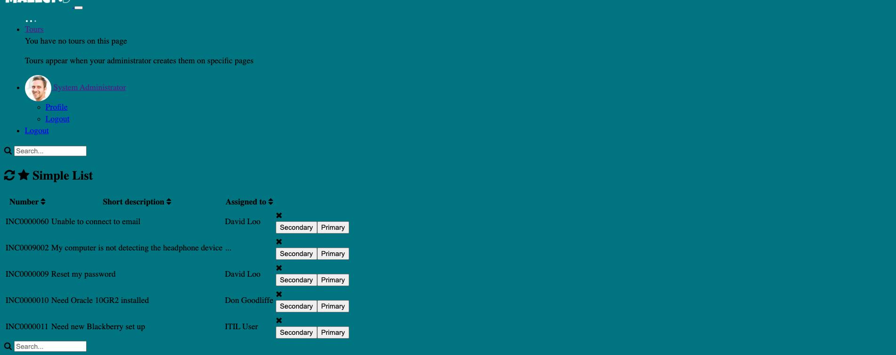
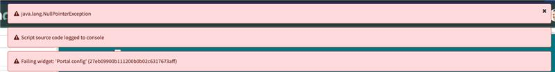
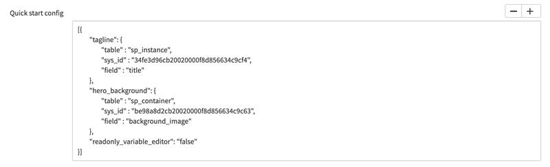
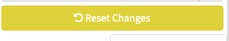

# Falling Widget: 'Portal Config' - Bug

## Problem

When you're at Branding Editor. Sometimes you can change something and break your Portal, as in the images below:

 

## Solution

Go to your portal record and look at this option in the Portal Record, check if there is sys_id empty or something else that looks strange

Other option is  change a color on Brand Editor. So this option will appear

